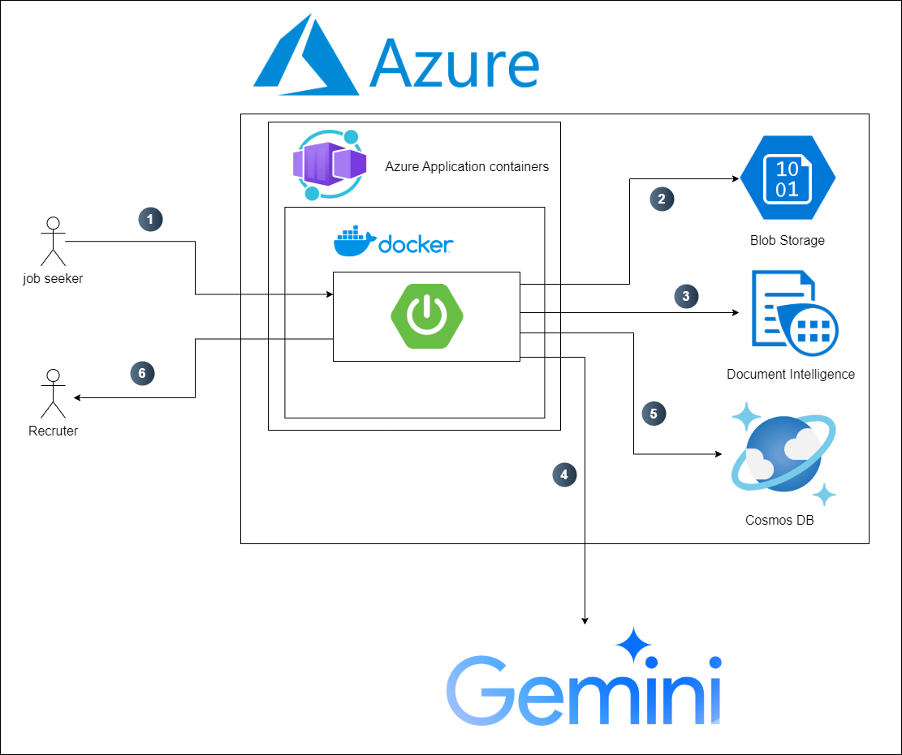

# Smart Hire
Smart Hire is a cloud-based recruitment platform designed to seamlessly connect job seekers and recruiters. It leverages Azure's cloud infrastructure, Docker containers, Spring Boot application, and powerful tools like Azure Blob Storage, Document Intelligence, and Cosmos DB.

## Features
1. Job Seeker Portal: Enables job seekers to upload their PDF resumes without entering any additional information.

2. Automated Resume Parsing: Utilizes a custom-trained Azure Document Intelligence model to extract structured data from resumes (e.g., name, email, experience, education, etc.).

3. Data Structuring: Passes raw text extracted by Document Intelligence to Gemini, which returns it as formatted HTML ready for display.

4. Job Matching: Gemini matches job offers with candidate information and provides a match percentage score (e.g., 80%) along with a brief explanation.

5. Recruiter Dashboard: Allows recruiters to view candidate information, verify model scores, and manage applications.

6. Cloud-Based Storage: Azure Blob Storage ensures secure and scalable storage for resumes.

7. Database Management: Cosmos DB (NoSQL, MongoDB) stores all extracted and processed data.

## Architecture

1. Frontend: 
    - Built using Thymeleaf templates.
    - User interface for job seekers and recruiters.
    - Displays candidate-job match scores, extracted informations and explanations.

2. Backend:
    - Built using Spring Boot, deployed in Azure Application Containers.
    - Handles resume uploads, data processing, and business logic.

3. Azure Services:
    - Blob Storage: Securely stores resumes.
    - Document Intelligence: Extracts raw text from resumes.
        - We trained custom azure document intelligence model on our resumes.
    - Cosmos DB: Stores extracted and processed data.
    - Azure container registry : To push the docker image
    - application containers : To run the container

4. Gemini:
    - Structures raw data from Document Intelligence into formatted HTML.
    - Matches job offers with candidate information and provides match scores with explanations.

### Workflow

1. Resume Upload: Job seekers upload resumes via the frontend.
2. Blob Storage: Resumes are uploaded to Azure Blob Storage.
3. Data extraction: Document Intelligence extracts the data from resumes.
4. Passing data to Gemini AI
    1. Data Structuring: Gemini processes raw data into formatted HTML.
    2. Job Matching: Gemini calculates match scores and explanations for job offers.
6. Database Update: Processed data and matching score is stored in Cosmos DB (MongoDB).
7. Recruiter Review: Recruiters access candidate information and job match details.

